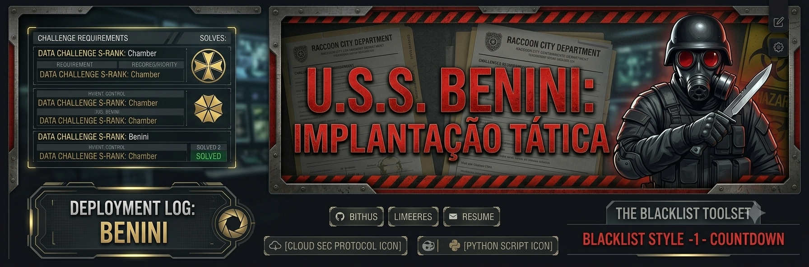
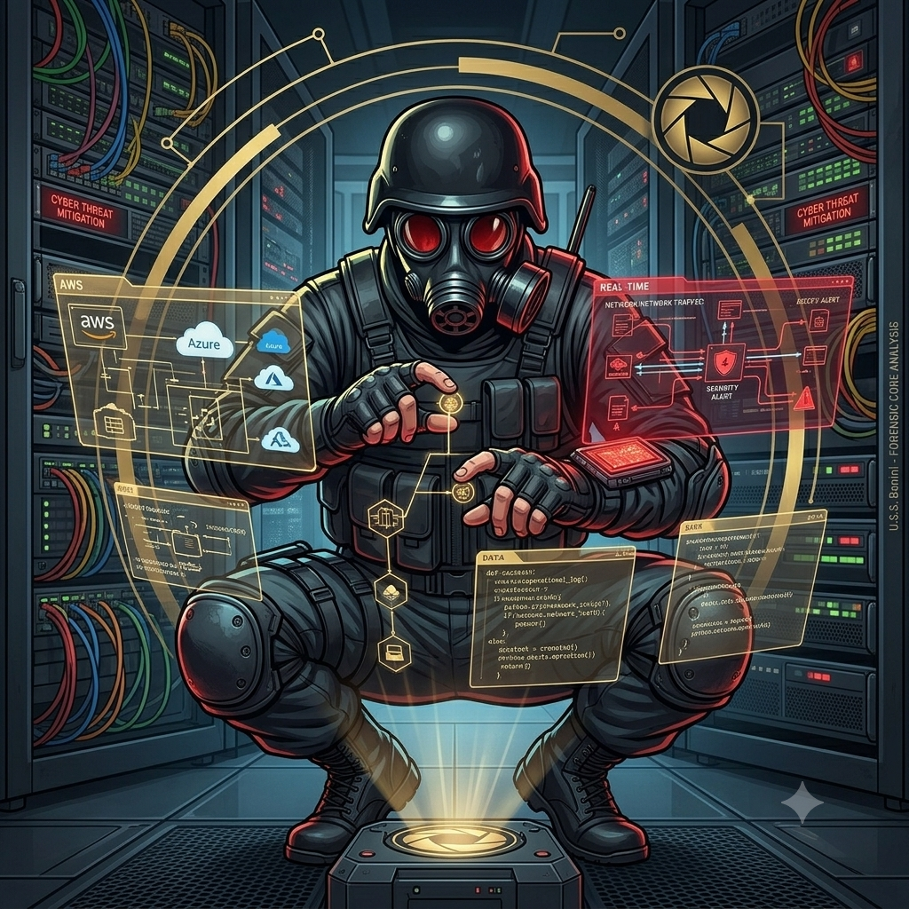

  

 

  
  
  

  
  
  

---

## ⚜️ Know About Me / Perfil Tático

<table border="0">
  <tr>
    <td width="40%">
      
    </td>
    <td width="60%" valign="top">
      <h3>Olá, eu sou o Carlos Eduardo Benini (Alias: Chamber)</h3>
      
<b>Analista de Infraestrutura | Cloud Architecture & Cybersecurity Enthusiast</b>

      
Sou um profissional de TI em constante evolução, com foco estratégico em Arquitetura de Nuvem, Administração de Sistemas Linux e Segurança de Redes. Minha filosofia de trabalho é pautada na construção de ambientes resilientes, resolução de problemas complexos e na priorização estrita da segurança da informação em cada camada da infraestrutura.

      
🎯 <b>Foco Atual:</b> Implementação de requisitos de segurança (normas ISO/IEC 27001), automações inteligentes com Python/Java e orquestração de ambientes escaláveis em nuvem (AWS e Azure).

      
📍 Panambi, Rio Grande do Sul - Brasil.

    </td>
  </tr>
</table>

---

## 📑 The Blacklist Toolset / Arsenal Técnico

As tecnologias e ferramentas que compõem meu arsenal operacional, divididas por categorias de implantação:

### ☁️ Cloud & Infrastructure
`☁️ AWS` `☁️ Azure` `🏗️ Cloud Architecture` `🖥️ Virtualização` `🛠️ Terraform & Ansible (IaC)`

### 🐧 OS & Server Management
`🐧 Linux (Debian/Ubuntu/CentOS)` `🪟 Windows Server` `💻 CLI Administration` `🔧 BIOS & Hardware Expert`

### 🛡️ Cybersecurity & Networks
`🔒 Redes Cisco` `🌐 Protocolos TCP/IP` `🔐 Criptografia (Python)` `🕵️ Análise de Vulnerabilidades` `🛡️ ISO/IEC 27001`

### 🐍 Automation & Development
`🐍 Python` `☕ Java` `🪟 PowerShell` `🤖 Automação de Processos & Scripts` `🗄️ MongoDB`

---

## 🔬 Laboratórios & Projetos Estratégicos

Aqui estão os repositórios focados em simulações táticas e pesquisa avançada:

* **[Cybersecurity-Lab](https://github.com/[SEU_USER]/Cybersecurity-Lab):** Desenvolvimento e simulação de ferramentas de segurança em Python (incluindo Keyloggers, simulações controladas de Ransomware para fins acadêmicos e auditorias usando ferramentas do Kali Linux como Medusa e Metasploit).
* **[Cloud-Architecture-Studies](https://github.com/[SEU_USER]/Cloud-Architecture-Studies):** Repositório dedicado a estudos de implementação de serviços em nuvem, desenho de arquiteturas seguras e automação de infraestrutura.
* **[WhatsApp-Rental-System](https://github.com/[SEU_USER]/WhatsApp-Rental-System):** Projeto de automação em Python e banco de dados para gestão e fluxo lógico de inventário e locação.

---

## 📊 Tactical Breakdown / Objetivos de Pesquisa

<table width="100%">
  <tr>
    <td width="50%" valign="top">
      <h4>🚀 Objetivos de Carreira</h4>
      <ul>
        <li>Desenvolver e migrar arquiteturas robustas e seguras para AWS e Azure.</li>
        <li>Implementar práticas sólidas de DevSecOps e automação de segurança contínua.</li>
        <li>Dominar ferramentas de Infraestrutura como Código (IaC) para eliminar o erro humano.</li>
        <li>Modernizar e blindar ambientes legados críticos contra ameaças modernas.</li>
      </ul>
    </td>
    <td width="50%" valign="top">
      <h4>🎓 Formação & Linhas de Estudo</h4>
      <ul>
        <li><b>Sistemas para Internet</b> – Foco em desenvolvimento, segurança e integração de serviços web.</li>
        <li><b>Pós-Graduação em Arquitetura e Infraestrutura em Nuvem</b> – Especialização em escalabilidade e resiliência.</li>
        <li><b>Linux Administrator</b> – Sólida base de administração via CLI com certificações NDG/Cisco.</li>
        <li><b>História dos Sistemas</b> – Pesquisa ativa sobre falhas lógicas de software históricas (ex: Therac-25, Ariane 5).</li>
      </ul>
    </td>
  </tr>
</table>

 

  

 

  <i>"Construindo o futuro da tecnologia sobre bases seguras e escaláveis."</i>

